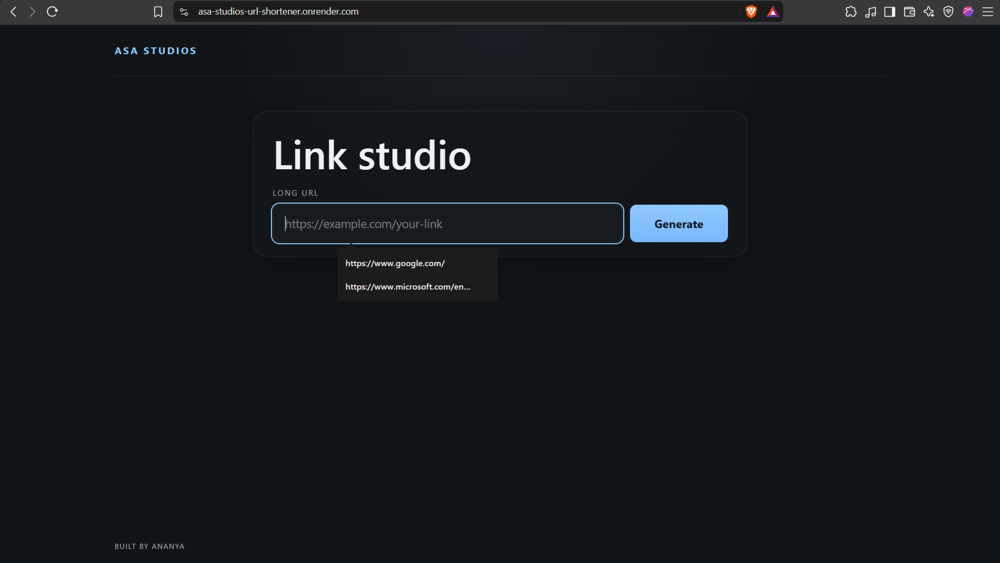
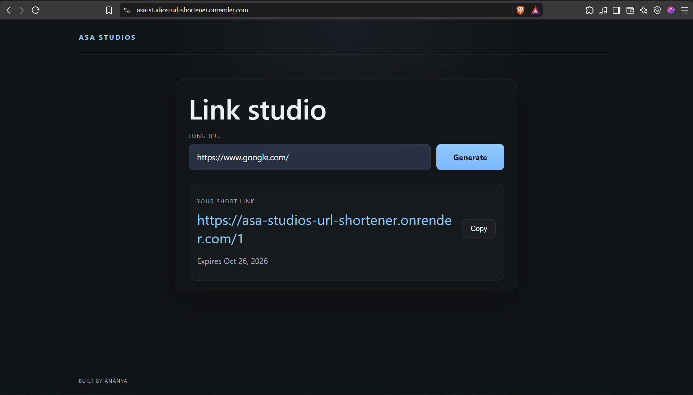
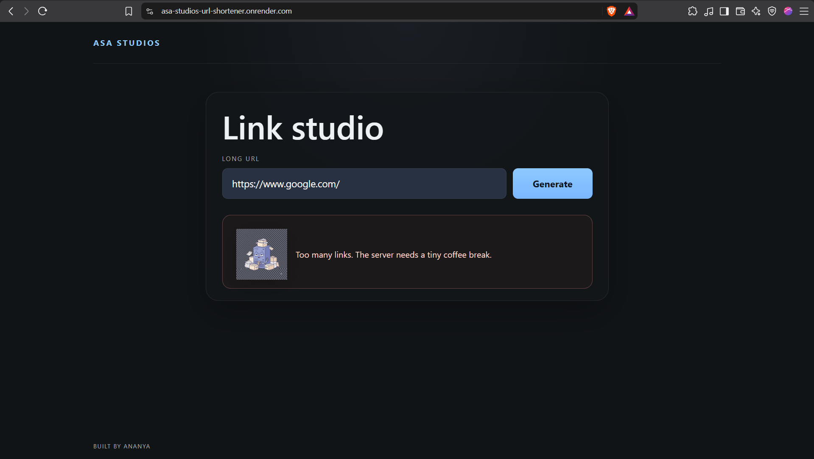
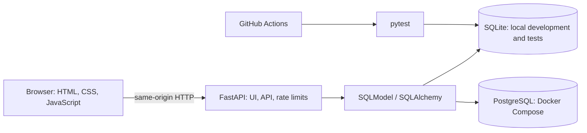

# ASA Studios URL Shortener

[](https://github.com/ananya-asa/asastudios-url-shortener/actions/workflows/tests.yml)

A compact URL-shortening service built with FastAPI, SQLModel, and a vanilla HTML/CSS/JavaScript frontend. It creates expiring short links, redirects visitors, and records click statistics.

**Live demo:** [asa-studios-url-shortener.onrender.com](https://asa-studios-url-shortener.onrender.com/)

## Screenshots

### Enter a URL



### Generated short link



### Rate-limit feedback



## Architecture



FastAPI serves the frontend and API from one origin. `DATABASE_URL` selects the database; Compose runs PostgreSQL alongside the API, while local development and the current test fixture use SQLite.

## Design Decisions

- **Lookup-first deduplication:** the service queries the unique `long_url` before inserting. Repeated submissions reuse the existing link and return `200`, while a newly created link returns `201`. The database unique constraint is a final integrity guard; concurrent first-time submissions are not currently retried after a uniqueness conflict.
- **Base62 codes from database IDs:** encoding the assigned integer ID produces compact URLs without maintaining a separate random-code generator. The tradeoff is that codes are predictable and enumerable; this is suitable for a demo, not for links that need unguessability.
- **Expiry is enforced at read time:** expired links return `410 Gone`. There is no scheduled purge job, so expired rows remain stored. Click rows declare an `ON DELETE CASCADE` foreign key; cleanup only applies when a URL row is physically deleted and the database enforces that constraint. Expiry itself does not delete rows or click history.
- **SQLite locally, PostgreSQL in Compose:** SQLite keeps setup fast and self-contained. PostgreSQL gives the containerized app a production-style relational database. The API chooses the database through `DATABASE_URL` rather than branching on database type.
- **One origin for the frontend and API:** relative requests such as `/shorten` avoid local CORS configuration and keep the interface deployable with the API.

## Features

- Create short links that expire after 30 days.
- Reuse a short link for a previously submitted destination.
- Redirect and record clicks; view total and per-day statistics.
- Apply per-client rate limits to link creation, redirects, and statistics.
- Return distinct `404` and `410` pages for unknown and expired links.

## Run Locally

Requirements: Python 3.11+.

```powershell
python -m venv .venv
.\.venv\Scripts\Activate.ps1
pip install -r requirements.txt
uvicorn app.main:app --reload --host 127.0.0.1 --port 8010
```

Open <http://127.0.0.1:8010>. Local development defaults to `sqlite:///./url_shortener.db`. Set `DATABASE_URL` to use another database. Set `PUBLIC_BASE_URL` when generated links should use a different public address; in PowerShell, for example:

```powershell
$env:PUBLIC_BASE_URL = "http://127.0.0.1:8010"
```

Interactive API documentation: <http://127.0.0.1:8010/docs>.

## Run with Docker Compose

Requirements: Docker Engine with the Compose plugin.

```sh
docker compose up --build
```

Open <http://127.0.0.1:8000>. Compose waits for PostgreSQL's health check before starting the API; database files persist in a named volume. The Compose default for generated URLs is `http://127.0.0.1:8000`. To use another public address, set `PUBLIC_BASE_URL` before starting Compose:

```powershell
$env:PUBLIC_BASE_URL = "https://short.example.com"
docker compose up --build
```

The credentials in Compose are development defaults and should be replaced before any production deployment.

## Deploy to Render

The live demo is deployed from the repository's Render Blueprint in `render.yaml`. Render builds the Docker image, provisions PostgreSQL, and supplies the database URL and public service URL. The current demo uses free plans: the web service may spin down when idle, and free PostgreSQL expires after 30 days (with a 14-day grace period to upgrade before deletion). Upgrade the database plan to retain deployed data beyond that period.

## API

| Method | Path | Behavior |
| --- | --- | --- |
| `POST` | `/shorten` | Send `{"long_url":"https://example.com"}`. New links return `201`; duplicate destinations return `200`. |
| `GET` | `/{short_code}` | Records a click and redirects to the destination with `302`. |
| `GET` | `/{short_code}/stats` | Returns total clicks and daily click counts. |
| `GET` | `/health` | Returns `{"status":"ok"}`. |

Invalid request data returns `422`; unknown codes return `404`; expired links return `410`. Rate limits are 5 creation requests, 100 redirects, and 15 stats requests per minute per client address; limited requests return `429`.

## Tests and CI

Run the suite locally:

```sh
python -m pytest -q
```

The tests cover new and duplicate URL creation, invalid input, creation rate limiting, redirects and click recording, unknown and expired codes, and statistics. The test fixture overrides the app's database dependency with an isolated in-memory SQLite database.

GitHub Actions runs the pytest suite on pushes and pull requests to `main`. Although the workflow currently provisions a PostgreSQL service, the fixture still uses SQLite, so the suite does **not** currently verify PostgreSQL-specific behavior. Docker Compose is the current path for running the app against PostgreSQL.
